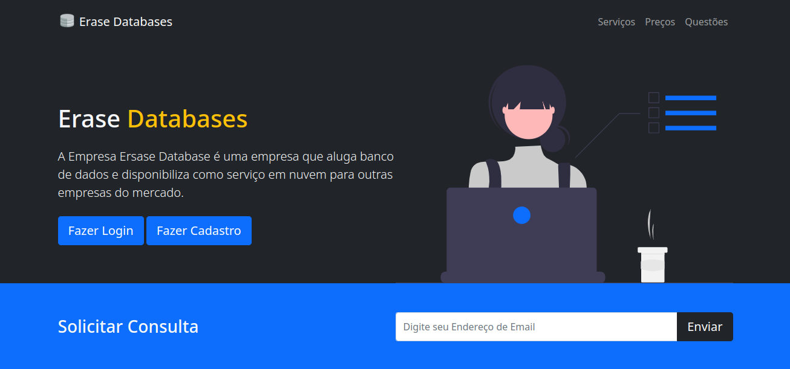

# Site da Empresa Fictícia de Aluguel de Data Center no Brasil

Este é o repositório do projeto do site de uma empresa fictícia que oferece serviços de aluguel de data center com banco de dados no Brasil. Neste arquivo README, você encontrará informações importantes sobre o projeto e instruções para executá-lo localmente.

## Conteúdo da Página

### No Cabelçalho

- [X] Navbar com o Conteúdo da Página.
- [X] Boas Vindas ao visitante.

### No Conteúdo Principal

- [X] Sessão de Sobre a Empresa.
- [X] Sessão de Serviços da Empresa.
- [X] Sessão de Preços e Planos.

### No Rodapé
- [X] Autores do Projeto.

## Tecnologias Utilizadas

O projeto do site da empresa fictícia de aluguel de data center utiliza as seguintes tecnologias:

- HTML5: Utilizado para estruturar e organizar o conteúdo do site.
- CSS3: Utilizado para estilizar os elementos do site e definir a aparência visual.
- JavaScript: Utilizado para adicionar interatividade e funcionalidades dinâmicas ao site.
- Bootstrap: Framework CSS utilizado para criar um design responsivo e facilitar o desenvolvimento.

## Executando o Projeto Localmente

Para executar o projeto localmente, siga as instruções abaixo:

```bash
git clone https://github.com/akicodeoficial/site-vendas-banco-de-dados.git
```

Abra o arquivo index.html em seu navegador preferido.

## Captura da Tela


